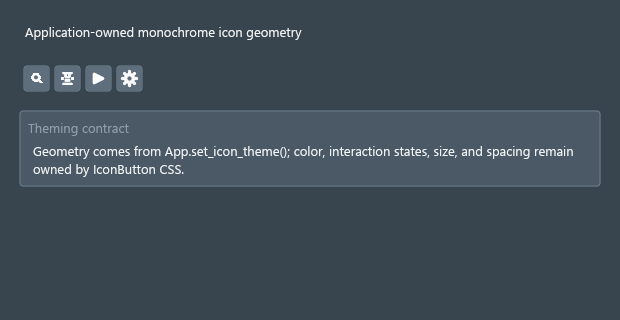
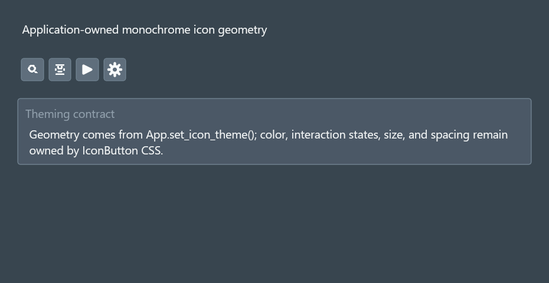

# DragonGUI Visual Audit Report

Generated: 2026-07-29 15:26:17 Eastern Daylight Time

This is a manifest-driven visual audit. `pass` means the saved screenshot state was visually reviewed against `artifacts/SPEC.md` and no obvious defect was recorded. `needs_manual_interaction` means the static capture was reviewed, but important hover/open/drag/focus or animated states still need manual or automated interaction coverage.

## Summary

- pass: 1
- needs_manual_interaction: 0
- fail: 0
- blocked: 0

## Targets

### Application Icon Theme (`icon-theme`)

- Status: `pass`
- Priority: `low`
- Probe: `examples\icon_theme_demo.py`
- Features: `IconButton`, `IconResource`, `IconStroke`, `semantic icon aliases`
- Screenshots: [icon-theme-desktop-1@1x.png](screenshots/icon-theme-desktop-1@1x.png), [icon-theme-desktop-2@1.5x.png](screenshots/icon-theme-desktop-2@1.5x.png), [icon-theme-desktop-3@2x.png](screenshots/icon-theme-desktop-3@2x.png)
- Debug snapshots: [icon-theme-desktop-1@1x.json](snapshots/icon-theme-desktop-1@1x.json), [icon-theme-desktop-2@1.5x.json](snapshots/icon-theme-desktop-2@1.5x.json), [icon-theme-desktop-3@2x.json](snapshots/icon-theme-desktop-3@2x.json)
- Logs: [icon-theme-desktop-1@1x.stdout.txt](logs/icon-theme-desktop-1@1x.stdout.txt), [icon-theme-desktop-1@1x.stderr.txt](logs/icon-theme-desktop-1@1x.stderr.txt), [icon-theme-desktop-2@1.5x.stdout.txt](logs/icon-theme-desktop-2@1.5x.stdout.txt), [icon-theme-desktop-2@1.5x.stderr.txt](logs/icon-theme-desktop-2@1.5x.stderr.txt), [icon-theme-desktop-3@2x.stdout.txt](logs/icon-theme-desktop-3@2x.stdout.txt), [icon-theme-desktop-3@2x.stderr.txt](logs/icon-theme-desktop-3@2x.stderr.txt)
- Unmatched selectors: _none_
- Layout diagnostics by code: _none_
- Notes: Phase 9 regression for resource-backed monochrome icon overrides and built-in fallback. Additional run: Captured with native DragonGUI window screenshot API.
- Suspected modules: `native/src/primitives/mod.rs`, `native/src/runtime.rs`
- Reproduction: `python tools/visual_audit.py --target icon-theme --sizes desktop-1 --scales 1`; `python tools/visual_audit.py --target icon-theme --sizes desktop-2 --scales 1.5`; `python tools/visual_audit.py --target icon-theme --sizes desktop-3 --scales 2`

#### Capture Gallery

| Size | Scale | Route | State | Thumbnail |
| --- | ---: | --- | --- | --- |
| `default` | `1x` | `_default_` | `default` |  |
| `default` | `1.5x` | `_default_` | `default` |  |
| `default` | `2x` | `_default_` | `default` |  |
