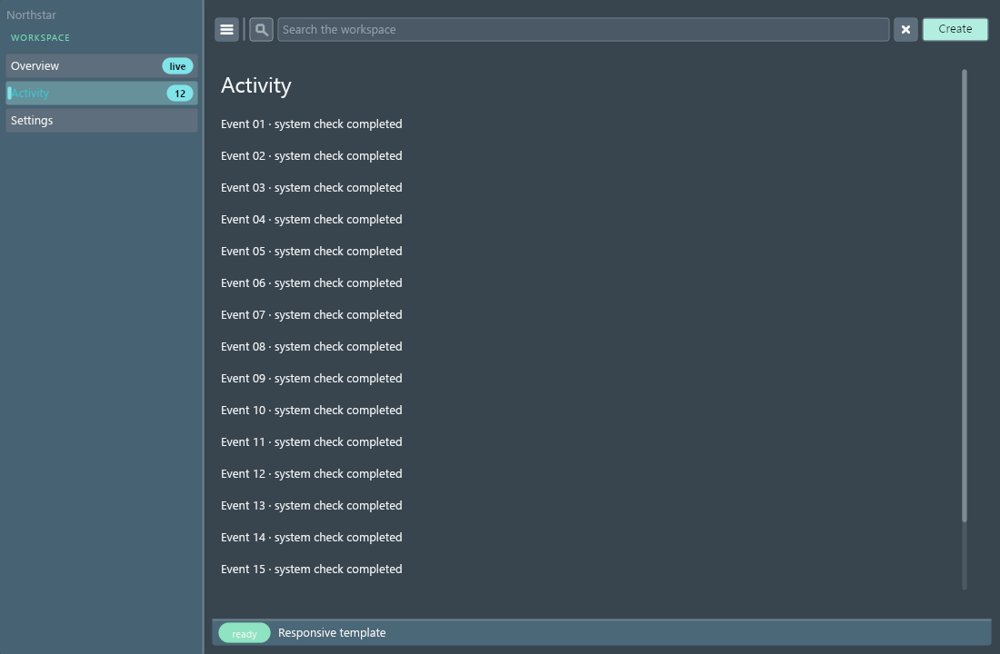
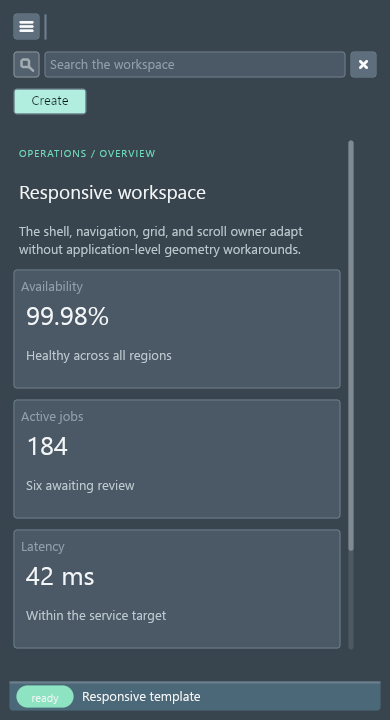
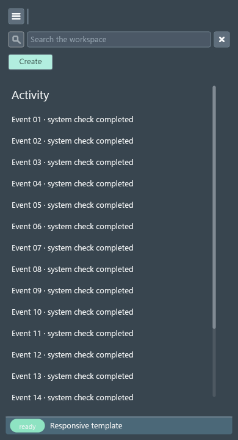
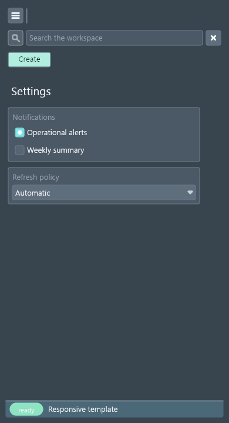
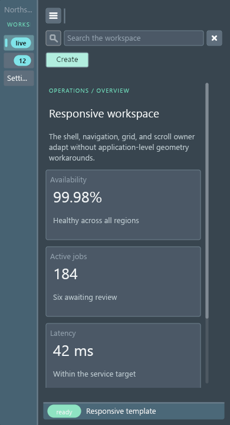

# DragonGUI Visual Audit Report

Generated: 2026-07-25 14:50:18 Eastern Daylight Time

This is a manifest-driven visual audit. `pass` means the saved screenshot state was visually reviewed against `artifacts/SPEC.md` and no obvious defect was recorded. `needs_manual_interaction` means the static capture was reviewed, but important hover/open/drag/focus or animated states still need manual or automated interaction coverage.

## Summary

- pass: 1
- needs_manual_interaction: 0
- fail: 0
- blocked: 0

## Targets

### Responsive Application Template (`responsive-app-template`)

- Status: `pass`
- Priority: `low`
- Probe: `examples\responsive_app_template.py`
- Features: `AppShell`, `Sidebar`, `WorkbenchLayout`, `Toolbar`, `Body`, `Pages`, `ScrollArea`, `responsive GridLayout`, `StatusBar`
- Screenshots: [responsive-app-template-1100x720@1x-overview.png](screenshots/responsive-app-template-1100x720@1x-overview.png), [responsive-app-template-1100x720@1x-activity.png](screenshots/responsive-app-template-1100x720@1x-activity.png), [responsive-app-template-1100x720@1x-settings.png](screenshots/responsive-app-template-1100x720@1x-settings.png), [responsive-app-template-1100x720@1x-sidebar-collapsed.png](screenshots/responsive-app-template-1100x720@1x-sidebar-collapsed.png), [responsive-app-template-390x720@1x-overview.png](screenshots/responsive-app-template-390x720@1x-overview.png), [responsive-app-template-390x720@1x-activity.png](screenshots/responsive-app-template-390x720@1x-activity.png), [responsive-app-template-390x720@1x-settings.png](screenshots/responsive-app-template-390x720@1x-settings.png), [responsive-app-template-390x720@1x-sidebar-collapsed.png](screenshots/responsive-app-template-390x720@1x-sidebar-collapsed.png)
- Debug snapshots: [responsive-app-template-1100x720@1x-overview.json](snapshots/responsive-app-template-1100x720@1x-overview.json), [responsive-app-template-1100x720@1x-activity.json](snapshots/responsive-app-template-1100x720@1x-activity.json), [responsive-app-template-1100x720@1x-settings.json](snapshots/responsive-app-template-1100x720@1x-settings.json), [responsive-app-template-1100x720@1x-sidebar-collapsed.json](snapshots/responsive-app-template-1100x720@1x-sidebar-collapsed.json), [responsive-app-template-390x720@1x-overview.json](snapshots/responsive-app-template-390x720@1x-overview.json), [responsive-app-template-390x720@1x-activity.json](snapshots/responsive-app-template-390x720@1x-activity.json), [responsive-app-template-390x720@1x-settings.json](snapshots/responsive-app-template-390x720@1x-settings.json), [responsive-app-template-390x720@1x-sidebar-collapsed.json](snapshots/responsive-app-template-390x720@1x-sidebar-collapsed.json)
- Logs: [responsive-app-template-1100x720@1x-overview.stdout.txt](logs/responsive-app-template-1100x720@1x-overview.stdout.txt), [responsive-app-template-1100x720@1x-overview.stderr.txt](logs/responsive-app-template-1100x720@1x-overview.stderr.txt), [responsive-app-template-1100x720@1x-activity.stdout.txt](logs/responsive-app-template-1100x720@1x-activity.stdout.txt), [responsive-app-template-1100x720@1x-activity.stderr.txt](logs/responsive-app-template-1100x720@1x-activity.stderr.txt), [responsive-app-template-1100x720@1x-settings.stdout.txt](logs/responsive-app-template-1100x720@1x-settings.stdout.txt), [responsive-app-template-1100x720@1x-settings.stderr.txt](logs/responsive-app-template-1100x720@1x-settings.stderr.txt), [responsive-app-template-1100x720@1x-sidebar-collapsed.stdout.txt](logs/responsive-app-template-1100x720@1x-sidebar-collapsed.stdout.txt), [responsive-app-template-1100x720@1x-sidebar-collapsed.stderr.txt](logs/responsive-app-template-1100x720@1x-sidebar-collapsed.stderr.txt), [responsive-app-template-390x720@1x-overview.stdout.txt](logs/responsive-app-template-390x720@1x-overview.stdout.txt), [responsive-app-template-390x720@1x-overview.stderr.txt](logs/responsive-app-template-390x720@1x-overview.stderr.txt), [responsive-app-template-390x720@1x-activity.stdout.txt](logs/responsive-app-template-390x720@1x-activity.stdout.txt), [responsive-app-template-390x720@1x-activity.stderr.txt](logs/responsive-app-template-390x720@1x-activity.stderr.txt), [responsive-app-template-390x720@1x-settings.stdout.txt](logs/responsive-app-template-390x720@1x-settings.stdout.txt), [responsive-app-template-390x720@1x-settings.stderr.txt](logs/responsive-app-template-390x720@1x-settings.stderr.txt), [responsive-app-template-390x720@1x-sidebar-collapsed.stdout.txt](logs/responsive-app-template-390x720@1x-sidebar-collapsed.stdout.txt), [responsive-app-template-390x720@1x-sidebar-collapsed.stderr.txt](logs/responsive-app-template-390x720@1x-sidebar-collapsed.stderr.txt)
- Unmatched selectors: _none_
- Layout diagnostics by code: `empty-paint-clip`: 8
- Notes: Small public-API template for responsive shells, navigation, grids, and explicit scroll ownership. Additional run: Captured with native DragonGUI window screenshot API.
- Suspected modules: `native/src/layout.rs`, `native/src/primitives/mod.rs`, `native/src/runtime.rs`
- Reproduction: `python tools/visual_audit.py --target responsive-app-template --sizes 1100x720 --scales 1 # state=overview`; `python tools/visual_audit.py --target responsive-app-template --sizes 1100x720 --scales 1 # state=activity`; `python tools/visual_audit.py --target responsive-app-template --sizes 1100x720 --scales 1 # state=settings`; `python tools/visual_audit.py --target responsive-app-template --sizes 1100x720 --scales 1 # state=sidebar-collapsed`; `python tools/visual_audit.py --target responsive-app-template --sizes 390x720 --scales 1 # state=overview`; `python tools/visual_audit.py --target responsive-app-template --sizes 390x720 --scales 1 # state=activity`; `python tools/visual_audit.py --target responsive-app-template --sizes 390x720 --scales 1 # state=settings`; `python tools/visual_audit.py --target responsive-app-template --sizes 390x720 --scales 1 # state=sidebar-collapsed`

#### Capture Gallery

| Size | Scale | Route | State | Thumbnail |
| --- | ---: | --- | --- | --- |
| `1100x720` | `1x` | `overview` | `overview` |  |
| `1100x720` | `1x` | `activity` | `activity` |  |
| `1100x720` | `1x` | `settings` | `settings` |  |
| `1100x720` | `1x` | `overview` | `sidebar-collapsed` |  |
| `390x720` | `1x` | `overview` | `overview` |  |
| `390x720` | `1x` | `activity` | `activity` |  |
| `390x720` | `1x` | `settings` | `settings` |  |
| `390x720` | `1x` | `overview` | `sidebar-collapsed` |  |

#### Diagnostic State Comparisons

- `1100x720 @ 1x`: `overview` → `activity` — `empty-paint-clip` +2
- `1100x720 @ 1x`: `overview` → `settings` — _no diagnostic changes_
- `1100x720 @ 1x`: `overview` → `sidebar-collapsed` — _no diagnostic changes_
- `390x720 @ 1x`: `overview` → `activity` — `empty-paint-clip` +3
- `390x720 @ 1x`: `overview` → `settings` — `empty-paint-clip` -1
- `390x720 @ 1x`: `overview` → `sidebar-collapsed` — _no diagnostic changes_

| Code | Widget | Page | Route / state | Size / scale | Artifacts | Reason |
| --- | --- | --- | --- | --- | --- | --- |
| `empty-paint-clip` | `dg-52` (`label`) | `dg-33` | `activity / activity` | `1100x720 @ 1x` | [snapshot](snapshots/responsive-app-template-1100x720@1x-activity.json), [node data](diagnostics/responsive-app-template-1100x720@1x-activity-dg-52.json), [screenshot](screenshots/responsive-app-template-1100x720@1x-activity.png) | empty-paint-clip: dg-52 label has rect (238.0, 684.0, 812.0, 25.0) but final clip (238.0, 656.0, 0.0, 0.0) is empty |
| `empty-paint-clip` | `dg-53` (`label`) | `dg-33` | `activity / activity` | `1100x720 @ 1x` | [snapshot](snapshots/responsive-app-template-1100x720@1x-activity.json), [node data](diagnostics/responsive-app-template-1100x720@1x-activity-dg-53.json), [screenshot](screenshots/responsive-app-template-1100x720@1x-activity.png) | empty-paint-clip: dg-53 label has rect (238.0, 719.0, 812.0, 25.0) but final clip (238.0, 656.0, 0.0, 0.0) is empty |
| `empty-paint-clip` | `dg-29` (`panel`) | `dg-15` | `overview / overview` | `390x720 @ 1x` | [snapshot](snapshots/responsive-app-template-390x720@1x-overview.json), [node data](diagnostics/responsive-app-template-390x720@1x-overview-dg-29.json), [screenshot](screenshots/responsive-app-template-390x720@1x-overview.png) | empty-paint-clip: dg-29 panel has rect (14.0, 660.0, 326.0, 122.0) but final clip (14.0, 656.0, 0.0, 0.0) is empty |
| `empty-paint-clip` | `dg-50` (`label`) | `dg-33` | `activity / activity` | `390x720 @ 1x` | [snapshot](snapshots/responsive-app-template-390x720@1x-activity.json), [node data](diagnostics/responsive-app-template-390x720@1x-activity-dg-50.json), [screenshot](screenshots/responsive-app-template-390x720@1x-activity.png) | empty-paint-clip: dg-50 label has rect (14.0, 673.0, 326.0, 25.0) but final clip (14.0, 656.0, 0.0, 0.0) is empty |
| `empty-paint-clip` | `dg-51` (`label`) | `dg-33` | `activity / activity` | `390x720 @ 1x` | [snapshot](snapshots/responsive-app-template-390x720@1x-activity.json), [node data](diagnostics/responsive-app-template-390x720@1x-activity-dg-51.json), [screenshot](screenshots/responsive-app-template-390x720@1x-activity.png) | empty-paint-clip: dg-51 label has rect (14.0, 708.0, 326.0, 25.0) but final clip (14.0, 656.0, 0.0, 0.0) is empty |
| `empty-paint-clip` | `dg-52` (`label`) | `dg-33` | `activity / activity` | `390x720 @ 1x` | [snapshot](snapshots/responsive-app-template-390x720@1x-activity.json), [node data](diagnostics/responsive-app-template-390x720@1x-activity-dg-52.json), [screenshot](screenshots/responsive-app-template-390x720@1x-activity.png) | empty-paint-clip: dg-52 label has rect (14.0, 743.0, 326.0, 25.0) but final clip (14.0, 656.0, 0.0, 0.0) is empty |
| `empty-paint-clip` | `dg-53` (`label`) | `dg-33` | `activity / activity` | `390x720 @ 1x` | [snapshot](snapshots/responsive-app-template-390x720@1x-activity.json), [node data](diagnostics/responsive-app-template-390x720@1x-activity-dg-53.json), [screenshot](screenshots/responsive-app-template-390x720@1x-activity.png) | empty-paint-clip: dg-53 label has rect (14.0, 778.0, 326.0, 25.0) but final clip (14.0, 656.0, 0.0, 0.0) is empty |
| `empty-paint-clip` | `dg-29` (`panel`) | `dg-15` | `overview / sidebar-collapsed` | `390x720 @ 1x` | [snapshot](snapshots/responsive-app-template-390x720@1x-sidebar-collapsed.json), [node data](diagnostics/responsive-app-template-390x720@1x-sidebar-collapsed-dg-29.json), [screenshot](screenshots/responsive-app-template-390x720@1x-sidebar-collapsed.png) | empty-paint-clip: dg-29 panel has rect (78.0, 678.0, 262.0, 122.0) but final clip (78.0, 656.0, 0.0, 0.0) is empty |
