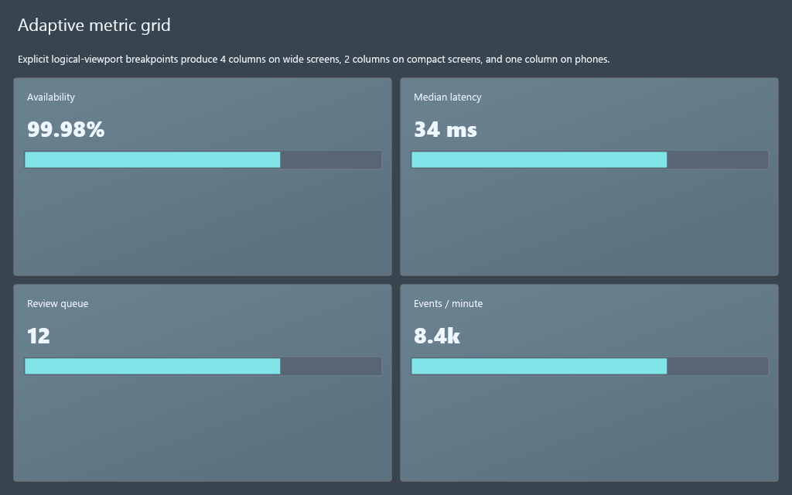
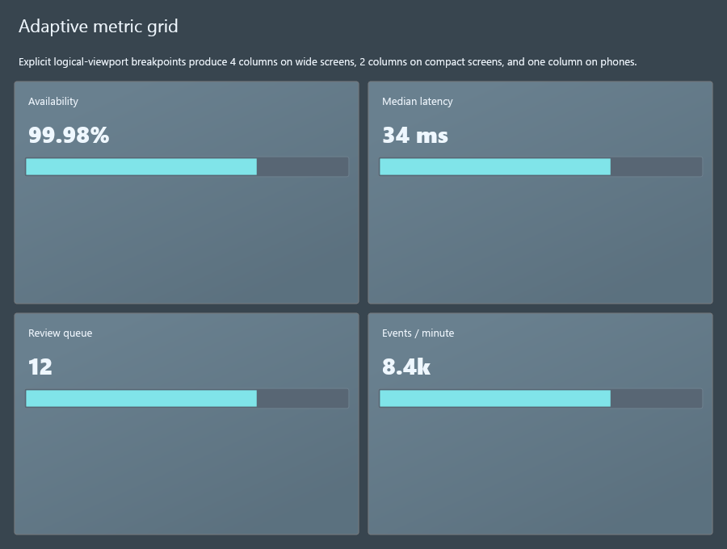
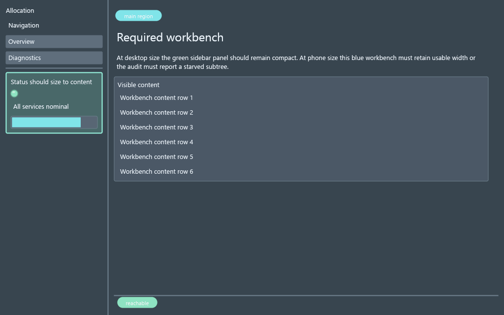
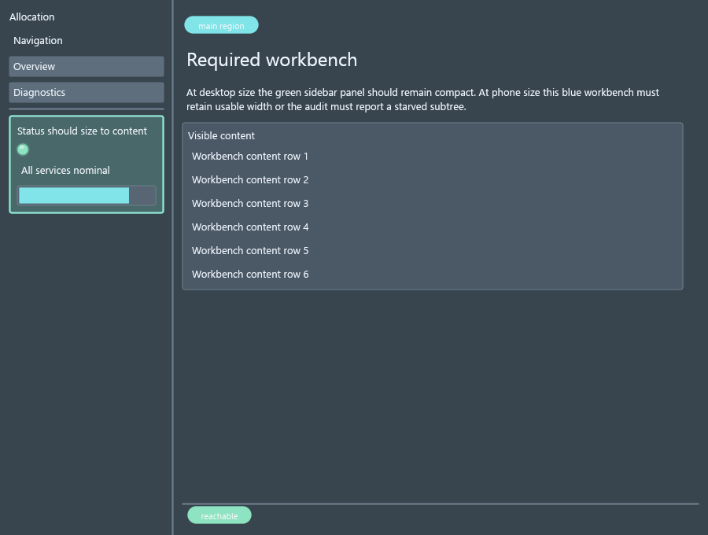

# DragonGUI Visual Audit Report

Generated: 2026-07-25 15:25:55 Eastern Daylight Time

This is a manifest-driven visual audit. `pass` means the saved screenshot state was visually reviewed against `artifacts/SPEC.md` and no obvious defect was recorded. `needs_manual_interaction` means the static capture was reviewed, but important hover/open/drag/focus or animated states still need manual or automated interaction coverage.

## Summary

- pass: 2
- needs_manual_interaction: 0
- fail: 0
- blocked: 0

## Targets

### Responsive Grid Orphan Baseline (`responsive-grid-orphan`)

- Status: `pass`
- Priority: `low`
- Probe: `examples\css_feature_probes\responsive_grid_orphan_probe.py`
- Features: `GridLayout`, `min_column_width`, `responsive columns`, `orphan balancing`
- Screenshots: [responsive-grid-orphan-1024x640@1x.png](screenshots/responsive-grid-orphan-1024x640@1x.png), [responsive-grid-orphan-900x680@1x.png](screenshots/responsive-grid-orphan-900x680@1x.png)
- Debug snapshots: [responsive-grid-orphan-1024x640@1x.json](snapshots/responsive-grid-orphan-1024x640@1x.json), [responsive-grid-orphan-1024x640@1x-resize-0-start-1024x640.json](snapshots/responsive-grid-orphan-1024x640@1x-resize-0-start-1024x640.json), [responsive-grid-orphan-1024x640@1x-resize-1-640x480.json](snapshots/responsive-grid-orphan-1024x640@1x-resize-1-640x480.json), [responsive-grid-orphan-1024x640@1x-resize-2-1024x768.json](snapshots/responsive-grid-orphan-1024x640@1x-resize-2-1024x768.json), [responsive-grid-orphan-1024x640@1x-resize-3-1024x640.json](snapshots/responsive-grid-orphan-1024x640@1x-resize-3-1024x640.json), [responsive-grid-orphan-900x680@1x.json](snapshots/responsive-grid-orphan-900x680@1x.json), [responsive-grid-orphan-900x680@1x-resize-0-start-900x680.json](snapshots/responsive-grid-orphan-900x680@1x-resize-0-start-900x680.json), [responsive-grid-orphan-900x680@1x-resize-1-640x480.json](snapshots/responsive-grid-orphan-900x680@1x-resize-1-640x480.json), [responsive-grid-orphan-900x680@1x-resize-2-1024x768.json](snapshots/responsive-grid-orphan-900x680@1x-resize-2-1024x768.json), [responsive-grid-orphan-900x680@1x-resize-3-900x680.json](snapshots/responsive-grid-orphan-900x680@1x-resize-3-900x680.json)
- Logs: [responsive-grid-orphan-1024x640@1x.stdout.txt](logs/responsive-grid-orphan-1024x640@1x.stdout.txt), [responsive-grid-orphan-1024x640@1x.stderr.txt](logs/responsive-grid-orphan-1024x640@1x.stderr.txt), [responsive-grid-orphan-900x680@1x.stdout.txt](logs/responsive-grid-orphan-900x680@1x.stdout.txt), [responsive-grid-orphan-900x680@1x.stderr.txt](logs/responsive-grid-orphan-900x680@1x.stderr.txt)
- Unmatched selectors: _none_
- Layout diagnostics by code: _none_
- Notes: Phase 0 baseline for explicit responsive columns and optional final-row balancing. Additional run: Captured with native DragonGUI window screenshot API.
- Suspected modules: `native/src/layout.rs`, `native/src/primitives/mod.rs`, `native/src/runtime.rs`
- Reproduction: `python tools/visual_audit.py --target responsive-grid-orphan --sizes 1024x640 --scales 1`; `python tools/visual_audit.py --target responsive-grid-orphan --sizes 900x680 --scales 1`

#### Capture Gallery

| Size | Scale | Route | State | Thumbnail |
| --- | ---: | --- | --- | --- |
| `1024x640` | `1x` | `_default_` | `default` |  |
| `900x680` | `1x` | `_default_` | `default` |  |

### Sidebar Flex Allocation Baseline (`sidebar-flex-allocation`)

- Status: `pass`
- Priority: `low`
- Probe: `examples\css_feature_probes\sidebar_flex_allocation_probe.py`
- Features: `Sidebar`, `Panel`, `AppShell`, `WorkbenchLayout`, `starved subtree`
- Screenshots: [sidebar-flex-allocation-1024x640@1x.png](screenshots/sidebar-flex-allocation-1024x640@1x.png), [sidebar-flex-allocation-900x680@1x.png](screenshots/sidebar-flex-allocation-900x680@1x.png)
- Debug snapshots: [sidebar-flex-allocation-1024x640@1x.json](snapshots/sidebar-flex-allocation-1024x640@1x.json), [sidebar-flex-allocation-1024x640@1x-resize-0-start-1024x640.json](snapshots/sidebar-flex-allocation-1024x640@1x-resize-0-start-1024x640.json), [sidebar-flex-allocation-1024x640@1x-resize-1-390x720.json](snapshots/sidebar-flex-allocation-1024x640@1x-resize-1-390x720.json), [sidebar-flex-allocation-1024x640@1x-resize-2-900x680.json](snapshots/sidebar-flex-allocation-1024x640@1x-resize-2-900x680.json), [sidebar-flex-allocation-1024x640@1x-resize-3-1024x640.json](snapshots/sidebar-flex-allocation-1024x640@1x-resize-3-1024x640.json), [sidebar-flex-allocation-900x680@1x.json](snapshots/sidebar-flex-allocation-900x680@1x.json), [sidebar-flex-allocation-900x680@1x-resize-0-start-900x680.json](snapshots/sidebar-flex-allocation-900x680@1x-resize-0-start-900x680.json), [sidebar-flex-allocation-900x680@1x-resize-1-390x720.json](snapshots/sidebar-flex-allocation-900x680@1x-resize-1-390x720.json), [sidebar-flex-allocation-900x680@1x-resize-2-900x680.json](snapshots/sidebar-flex-allocation-900x680@1x-resize-2-900x680.json), [sidebar-flex-allocation-900x680@1x-resize-3-900x680.json](snapshots/sidebar-flex-allocation-900x680@1x-resize-3-900x680.json)
- Logs: [sidebar-flex-allocation-1024x640@1x.stdout.txt](logs/sidebar-flex-allocation-1024x640@1x.stdout.txt), [sidebar-flex-allocation-1024x640@1x.stderr.txt](logs/sidebar-flex-allocation-1024x640@1x.stderr.txt), [sidebar-flex-allocation-900x680@1x.stdout.txt](logs/sidebar-flex-allocation-900x680@1x.stdout.txt), [sidebar-flex-allocation-900x680@1x.stderr.txt](logs/sidebar-flex-allocation-900x680@1x.stderr.txt)
- Unmatched selectors: _none_
- Layout diagnostics by code: _none_
- Notes: Phase 0 baseline for content-sized sidebar children and zero-width workbench detection. Additional run: Captured with native DragonGUI window screenshot API.
- Suspected modules: `native/src/layout.rs`, `native/src/primitives/mod.rs`, `native/src/runtime.rs`
- Reproduction: `python tools/visual_audit.py --target sidebar-flex-allocation --sizes 1024x640 --scales 1`; `python tools/visual_audit.py --target sidebar-flex-allocation --sizes 900x680 --scales 1`

#### Capture Gallery

| Size | Scale | Route | State | Thumbnail |
| --- | ---: | --- | --- | --- |
| `1024x640` | `1x` | `_default_` | `default` |  |
| `900x680` | `1x` | `_default_` | `default` |  |
