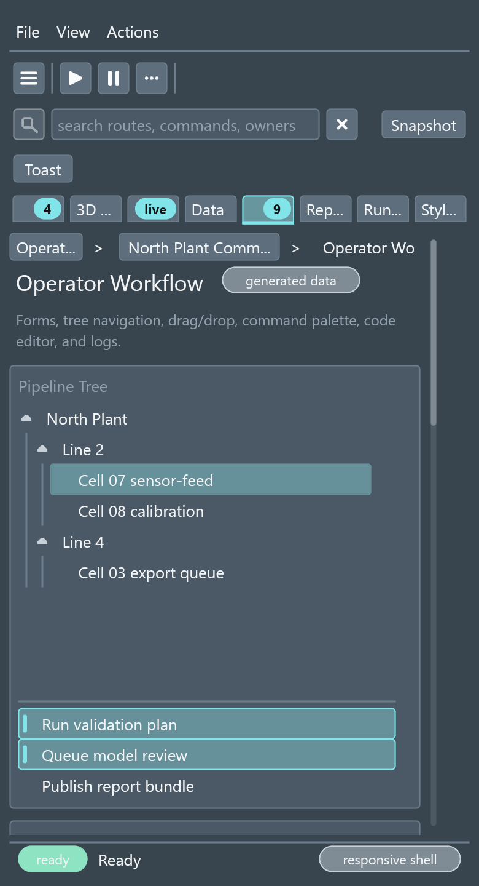
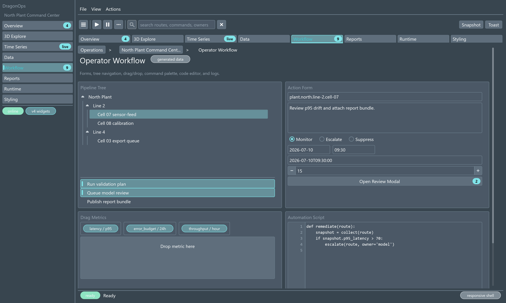

# DragonGUI Visual Audit Report

Generated: 2026-07-25 15:24:11 Eastern Daylight Time

This is a manifest-driven visual audit. `pass` means the saved screenshot state was visually reviewed against `artifacts/SPEC.md` and no obvious defect was recorded. `needs_manual_interaction` means the static capture was reviewed, but important hover/open/drag/focus or animated states still need manual or automated interaction coverage.

## Summary

- pass: 1
- needs_manual_interaction: 0
- fail: 0
- blocked: 0

## Targets

### All Features Professional Demo - Workflow (`all-features-professional-workflow`)

- Status: `pass`
- Priority: `low`
- Probe: `examples\css_feature_probes\all_features_professional_demo_probe.py`
- Features: `Professional demo`, `TreeView`, `SelectableList`, `DragSource`, `DropZone`, `CodeEditor`, `LogView`, `DateTimeInput`
- Screenshots: [all-features-professional-workflow-390x720@1x.png](screenshots/all-features-professional-workflow-390x720@1x.png), [all-features-professional-workflow-390x720@2x.png](screenshots/all-features-professional-workflow-390x720@2x.png), [all-features-professional-workflow-1440x900@1x.png](screenshots/all-features-professional-workflow-1440x900@1x.png), [all-features-professional-workflow-1440x900@2x.png](screenshots/all-features-professional-workflow-1440x900@2x.png)
- Debug snapshots: [all-features-professional-workflow-390x720@1x.json](snapshots/all-features-professional-workflow-390x720@1x.json), [all-features-professional-workflow-390x720@2x.json](snapshots/all-features-professional-workflow-390x720@2x.json), [all-features-professional-workflow-1440x900@1x.json](snapshots/all-features-professional-workflow-1440x900@1x.json), [all-features-professional-workflow-1440x900@2x.json](snapshots/all-features-professional-workflow-1440x900@2x.json)
- Logs: [all-features-professional-workflow-390x720@1x.stdout.txt](logs/all-features-professional-workflow-390x720@1x.stdout.txt), [all-features-professional-workflow-390x720@1x.stderr.txt](logs/all-features-professional-workflow-390x720@1x.stderr.txt), [all-features-professional-workflow-390x720@2x.stdout.txt](logs/all-features-professional-workflow-390x720@2x.stdout.txt), [all-features-professional-workflow-390x720@2x.stderr.txt](logs/all-features-professional-workflow-390x720@2x.stderr.txt), [all-features-professional-workflow-1440x900@1x.stdout.txt](logs/all-features-professional-workflow-1440x900@1x.stdout.txt), [all-features-professional-workflow-1440x900@1x.stderr.txt](logs/all-features-professional-workflow-1440x900@1x.stderr.txt), [all-features-professional-workflow-1440x900@2x.stdout.txt](logs/all-features-professional-workflow-1440x900@2x.stdout.txt), [all-features-professional-workflow-1440x900@2x.stderr.txt](logs/all-features-professional-workflow-1440x900@2x.stderr.txt)
- Unmatched selectors: _none_
- Layout diagnostics by code: _none_
- Notes: Route-specific capture for the professional all-features demo workflow page. Additional run: Captured with native DragonGUI window screenshot API.
- Suspected modules: `native/src/layout.rs`, `native/src/primitives/mod.rs`, `native/src/runtime.rs`, `native/src/text/mod.rs`
- Reproduction: `python tools/visual_audit.py --target all-features-professional-workflow --sizes 390x720 --scales 1`; `python tools/visual_audit.py --target all-features-professional-workflow --sizes 390x720 --scales 2`; `python tools/visual_audit.py --target all-features-professional-workflow --sizes 1440x900 --scales 1`; `python tools/visual_audit.py --target all-features-professional-workflow --sizes 1440x900 --scales 2`

#### Capture Gallery

| Size | Scale | Route | State | Thumbnail |
| --- | ---: | --- | --- | --- |
| `390x720` | `1x` | `_default_` | `default` |  |
| `390x720` | `2x` | `_default_` | `default` |  |
| `1440x900` | `1x` | `_default_` | `default` |  |
| `1440x900` | `2x` | `_default_` | `default` |  |
