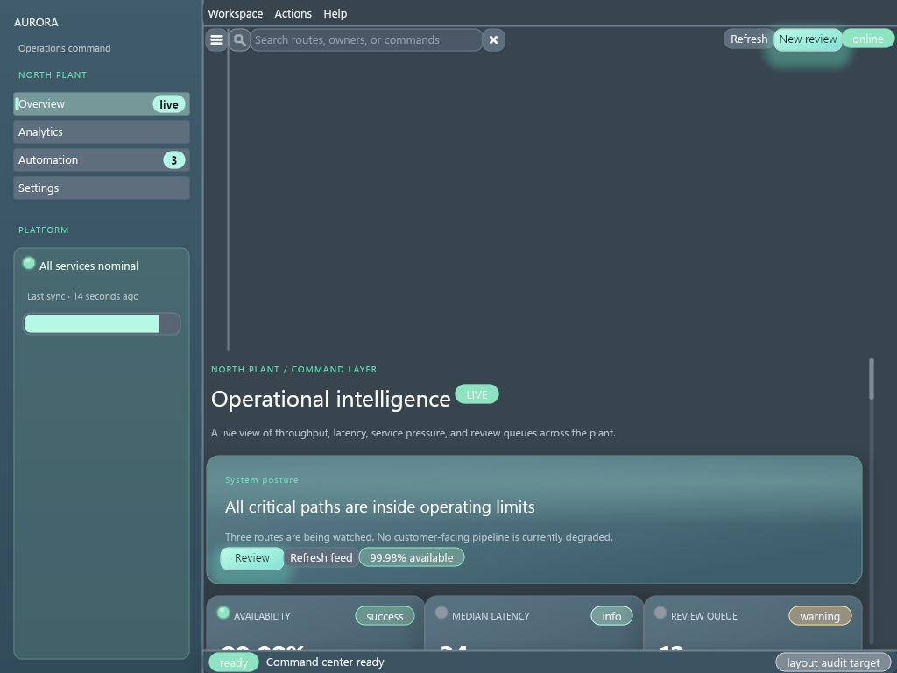
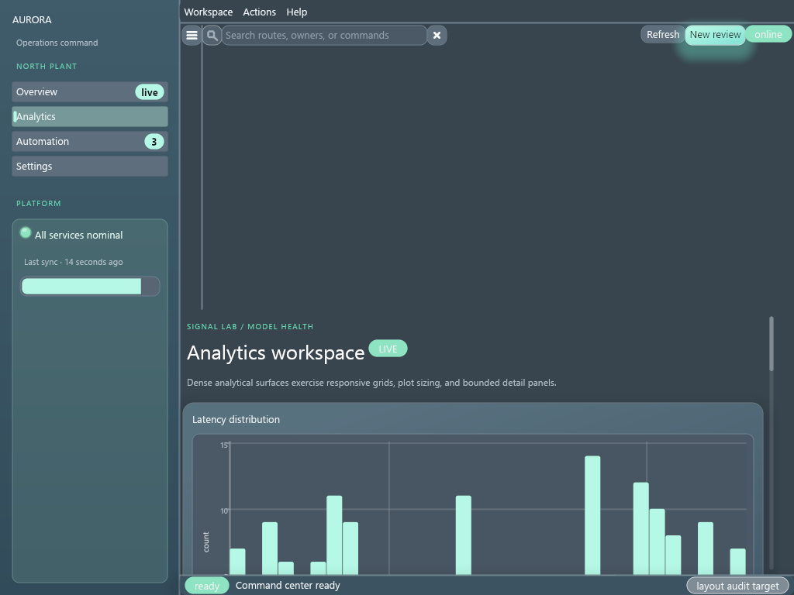
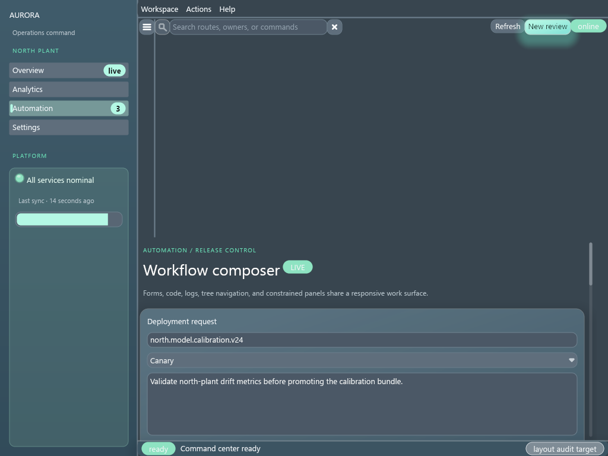
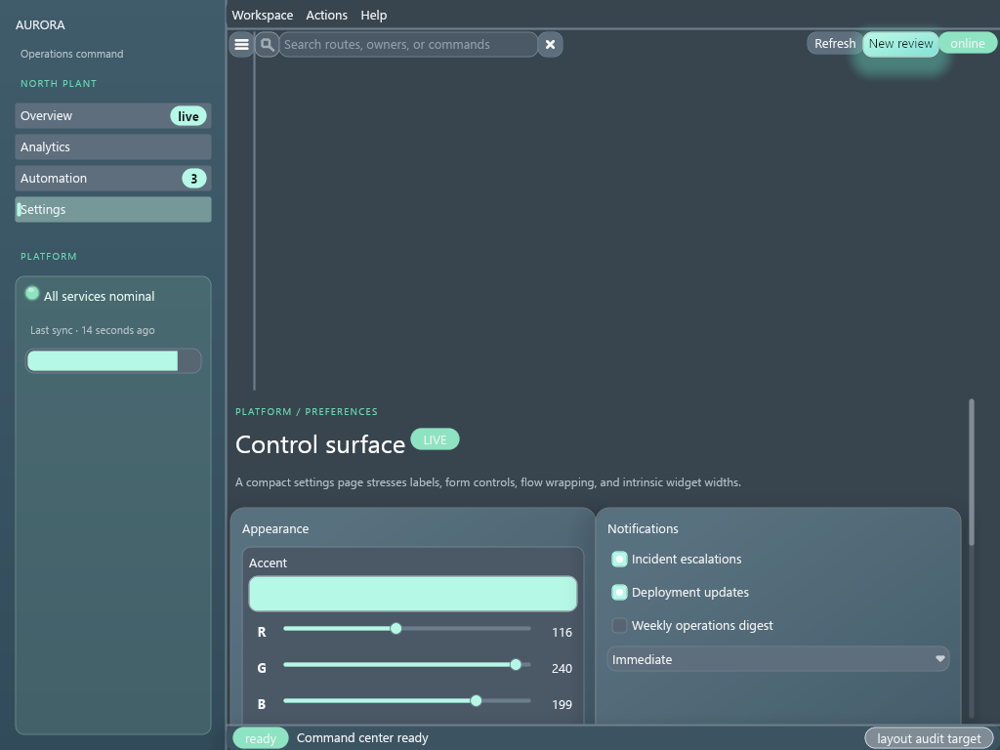
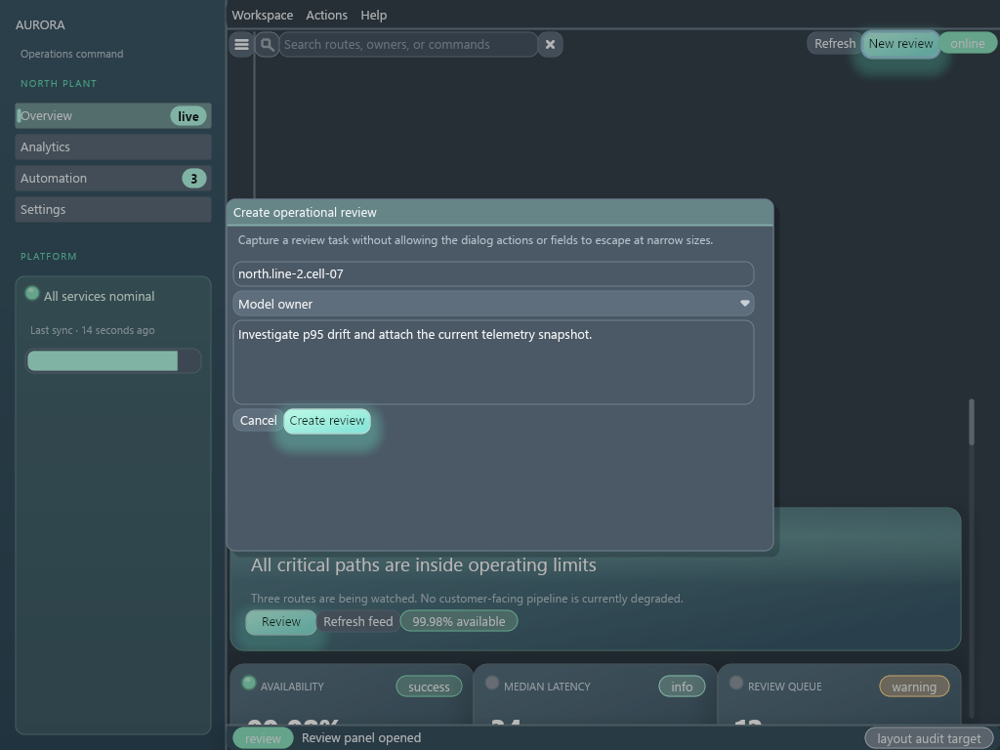
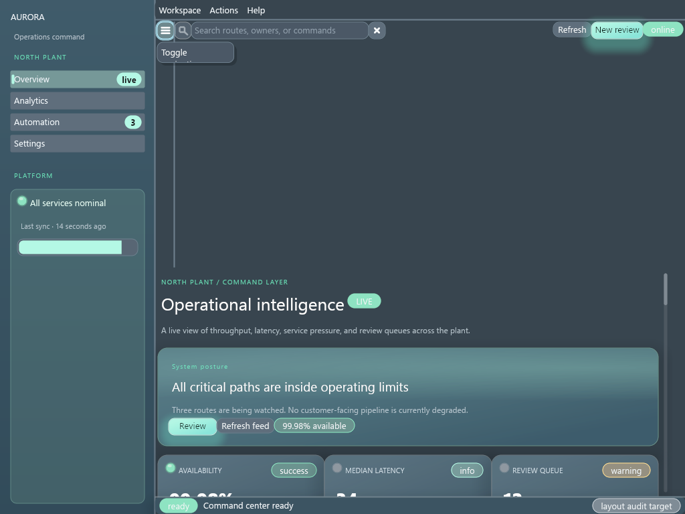
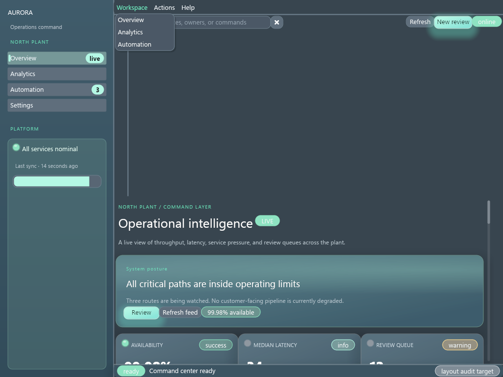
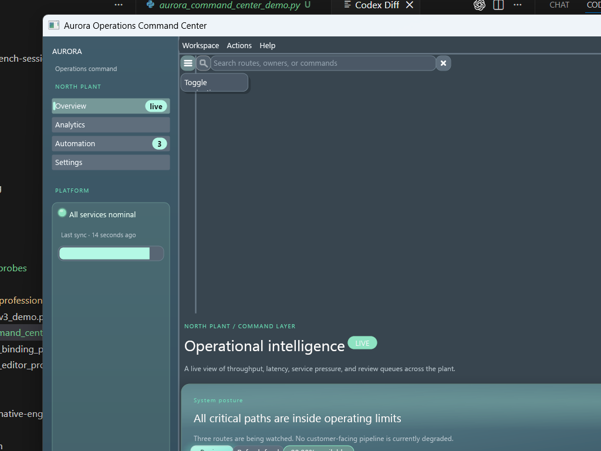
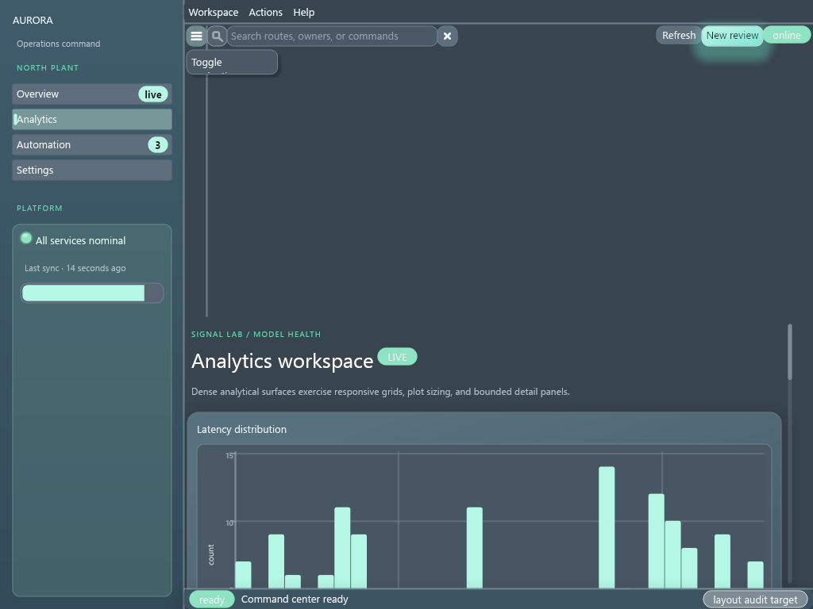

# DragonGUI Visual Audit Report

Generated: 2026-07-25 14:36:06 Eastern Daylight Time

This is a manifest-driven visual audit. `pass` means the saved screenshot state was visually reviewed against `artifacts/SPEC.md` and no obvious defect was recorded. `needs_manual_interaction` means the static capture was reviewed, but important hover/open/drag/focus or animated states still need manual or automated interaction coverage.

## Summary

- pass: 1
- needs_manual_interaction: 0
- fail: 0
- blocked: 0

## Targets

### Aurora Operations Command Center (`aurora-command-center`)

- Status: `pass`
- Priority: `low`
- Probe: `examples\aurora_command_center_demo.py`
- Features: `Sophisticated application demo`, `AppShell`, `Sidebar`, `WorkbenchLayout`, `MenuBar`, `Toolbar`, `Pages`, `Body`, `ScrollArea`, `GridLayout`, `FlowLayout`, `DataFrameTable`, `charts`, `forms`, `Modal`, `StatusBar`
- Screenshots: [aurora-command-center-1024x768@1x-overview.png](screenshots/aurora-command-center-1024x768@1x-overview.png), [aurora-command-center-1024x768@1x-analytics.png](screenshots/aurora-command-center-1024x768@1x-analytics.png), [aurora-command-center-1024x768@1x-automation.png](screenshots/aurora-command-center-1024x768@1x-automation.png), [aurora-command-center-1024x768@1x-settings.png](screenshots/aurora-command-center-1024x768@1x-settings.png), [aurora-command-center-1024x768@1x-modal-open.png](screenshots/aurora-command-center-1024x768@1x-modal-open.png), [aurora-command-center-1024x768@1x-sidebar-collapsed.png](screenshots/aurora-command-center-1024x768@1x-sidebar-collapsed.png), [aurora-command-center-1024x768@1x-workspace-menu.png](screenshots/aurora-command-center-1024x768@1x-workspace-menu.png), [aurora-command-center-1024x768@1x-sidebar-tooltip.png](screenshots/aurora-command-center-1024x768@1x-sidebar-tooltip.png), [aurora-command-center-1024x768@1x-analytics-scrolled.png](screenshots/aurora-command-center-1024x768@1x-analytics-scrolled.png)
- Debug snapshots: [aurora-command-center-1024x768@1x-overview.json](snapshots/aurora-command-center-1024x768@1x-overview.json), [aurora-command-center-1024x768@1x-overview-resize-0-start-1024x768.json](snapshots/aurora-command-center-1024x768@1x-overview-resize-0-start-1024x768.json), [aurora-command-center-1024x768@1x-overview-resize-1-640x480.json](snapshots/aurora-command-center-1024x768@1x-overview-resize-1-640x480.json), [aurora-command-center-1024x768@1x-overview-resize-2-1024x768.json](snapshots/aurora-command-center-1024x768@1x-overview-resize-2-1024x768.json), [aurora-command-center-1024x768@1x-overview-resize-3-1024x768.json](snapshots/aurora-command-center-1024x768@1x-overview-resize-3-1024x768.json), [aurora-command-center-1024x768@1x-analytics.json](snapshots/aurora-command-center-1024x768@1x-analytics.json), [aurora-command-center-1024x768@1x-analytics-resize-0-start-1024x768.json](snapshots/aurora-command-center-1024x768@1x-analytics-resize-0-start-1024x768.json), [aurora-command-center-1024x768@1x-analytics-resize-1-640x480.json](snapshots/aurora-command-center-1024x768@1x-analytics-resize-1-640x480.json), [aurora-command-center-1024x768@1x-analytics-resize-2-1024x768.json](snapshots/aurora-command-center-1024x768@1x-analytics-resize-2-1024x768.json), [aurora-command-center-1024x768@1x-analytics-resize-3-1024x768.json](snapshots/aurora-command-center-1024x768@1x-analytics-resize-3-1024x768.json), [aurora-command-center-1024x768@1x-automation.json](snapshots/aurora-command-center-1024x768@1x-automation.json), [aurora-command-center-1024x768@1x-automation-resize-0-start-1024x768.json](snapshots/aurora-command-center-1024x768@1x-automation-resize-0-start-1024x768.json), [aurora-command-center-1024x768@1x-automation-resize-1-640x480.json](snapshots/aurora-command-center-1024x768@1x-automation-resize-1-640x480.json), [aurora-command-center-1024x768@1x-automation-resize-2-1024x768.json](snapshots/aurora-command-center-1024x768@1x-automation-resize-2-1024x768.json), [aurora-command-center-1024x768@1x-automation-resize-3-1024x768.json](snapshots/aurora-command-center-1024x768@1x-automation-resize-3-1024x768.json), [aurora-command-center-1024x768@1x-settings.json](snapshots/aurora-command-center-1024x768@1x-settings.json), [aurora-command-center-1024x768@1x-settings-resize-0-start-1024x768.json](snapshots/aurora-command-center-1024x768@1x-settings-resize-0-start-1024x768.json), [aurora-command-center-1024x768@1x-settings-resize-1-640x480.json](snapshots/aurora-command-center-1024x768@1x-settings-resize-1-640x480.json), [aurora-command-center-1024x768@1x-settings-resize-2-1024x768.json](snapshots/aurora-command-center-1024x768@1x-settings-resize-2-1024x768.json), [aurora-command-center-1024x768@1x-settings-resize-3-1024x768.json](snapshots/aurora-command-center-1024x768@1x-settings-resize-3-1024x768.json), [aurora-command-center-1024x768@1x-modal-open.json](snapshots/aurora-command-center-1024x768@1x-modal-open.json), [aurora-command-center-1024x768@1x-modal-open-resize-0-start-1024x768.json](snapshots/aurora-command-center-1024x768@1x-modal-open-resize-0-start-1024x768.json), [aurora-command-center-1024x768@1x-modal-open-resize-1-640x480.json](snapshots/aurora-command-center-1024x768@1x-modal-open-resize-1-640x480.json), [aurora-command-center-1024x768@1x-modal-open-resize-2-1024x768.json](snapshots/aurora-command-center-1024x768@1x-modal-open-resize-2-1024x768.json), [aurora-command-center-1024x768@1x-modal-open-resize-3-1024x768.json](snapshots/aurora-command-center-1024x768@1x-modal-open-resize-3-1024x768.json), [aurora-command-center-1024x768@1x-sidebar-collapsed.json](snapshots/aurora-command-center-1024x768@1x-sidebar-collapsed.json), [aurora-command-center-1024x768@1x-sidebar-collapsed-resize-0-start-1024x768.json](snapshots/aurora-command-center-1024x768@1x-sidebar-collapsed-resize-0-start-1024x768.json), [aurora-command-center-1024x768@1x-sidebar-collapsed-resize-1-640x480.json](snapshots/aurora-command-center-1024x768@1x-sidebar-collapsed-resize-1-640x480.json), [aurora-command-center-1024x768@1x-sidebar-collapsed-resize-2-1024x768.json](snapshots/aurora-command-center-1024x768@1x-sidebar-collapsed-resize-2-1024x768.json), [aurora-command-center-1024x768@1x-sidebar-collapsed-resize-3-1024x768.json](snapshots/aurora-command-center-1024x768@1x-sidebar-collapsed-resize-3-1024x768.json), [aurora-command-center-1024x768@1x-workspace-menu.json](snapshots/aurora-command-center-1024x768@1x-workspace-menu.json), [aurora-command-center-1024x768@1x-workspace-menu-resize-0-start-1024x768.json](snapshots/aurora-command-center-1024x768@1x-workspace-menu-resize-0-start-1024x768.json), [aurora-command-center-1024x768@1x-workspace-menu-resize-1-640x480.json](snapshots/aurora-command-center-1024x768@1x-workspace-menu-resize-1-640x480.json), [aurora-command-center-1024x768@1x-workspace-menu-resize-2-1024x768.json](snapshots/aurora-command-center-1024x768@1x-workspace-menu-resize-2-1024x768.json), [aurora-command-center-1024x768@1x-workspace-menu-resize-3-1024x768.json](snapshots/aurora-command-center-1024x768@1x-workspace-menu-resize-3-1024x768.json), [aurora-command-center-1024x768@1x-sidebar-tooltip.json](snapshots/aurora-command-center-1024x768@1x-sidebar-tooltip.json), [aurora-command-center-1024x768@1x-sidebar-tooltip-resize-0-start-1024x768.json](snapshots/aurora-command-center-1024x768@1x-sidebar-tooltip-resize-0-start-1024x768.json), [aurora-command-center-1024x768@1x-sidebar-tooltip-resize-1-640x480.json](snapshots/aurora-command-center-1024x768@1x-sidebar-tooltip-resize-1-640x480.json), [aurora-command-center-1024x768@1x-sidebar-tooltip-resize-2-1024x768.json](snapshots/aurora-command-center-1024x768@1x-sidebar-tooltip-resize-2-1024x768.json), [aurora-command-center-1024x768@1x-sidebar-tooltip-resize-3-1024x768.json](snapshots/aurora-command-center-1024x768@1x-sidebar-tooltip-resize-3-1024x768.json), [aurora-command-center-1024x768@1x-analytics-scrolled.json](snapshots/aurora-command-center-1024x768@1x-analytics-scrolled.json), [aurora-command-center-1024x768@1x-analytics-scrolled-resize-0-start-1024x768.json](snapshots/aurora-command-center-1024x768@1x-analytics-scrolled-resize-0-start-1024x768.json), [aurora-command-center-1024x768@1x-analytics-scrolled-resize-1-640x480.json](snapshots/aurora-command-center-1024x768@1x-analytics-scrolled-resize-1-640x480.json), [aurora-command-center-1024x768@1x-analytics-scrolled-resize-2-1024x768.json](snapshots/aurora-command-center-1024x768@1x-analytics-scrolled-resize-2-1024x768.json), [aurora-command-center-1024x768@1x-analytics-scrolled-resize-3-1024x768.json](snapshots/aurora-command-center-1024x768@1x-analytics-scrolled-resize-3-1024x768.json)
- Logs: [aurora-command-center-1024x768@1x-overview.stdout.txt](logs/aurora-command-center-1024x768@1x-overview.stdout.txt), [aurora-command-center-1024x768@1x-overview.stderr.txt](logs/aurora-command-center-1024x768@1x-overview.stderr.txt), [aurora-command-center-1024x768@1x-analytics.stdout.txt](logs/aurora-command-center-1024x768@1x-analytics.stdout.txt), [aurora-command-center-1024x768@1x-analytics.stderr.txt](logs/aurora-command-center-1024x768@1x-analytics.stderr.txt), [aurora-command-center-1024x768@1x-automation.stdout.txt](logs/aurora-command-center-1024x768@1x-automation.stdout.txt), [aurora-command-center-1024x768@1x-automation.stderr.txt](logs/aurora-command-center-1024x768@1x-automation.stderr.txt), [aurora-command-center-1024x768@1x-settings.stdout.txt](logs/aurora-command-center-1024x768@1x-settings.stdout.txt), [aurora-command-center-1024x768@1x-settings.stderr.txt](logs/aurora-command-center-1024x768@1x-settings.stderr.txt), [aurora-command-center-1024x768@1x-modal-open.stdout.txt](logs/aurora-command-center-1024x768@1x-modal-open.stdout.txt), [aurora-command-center-1024x768@1x-modal-open.stderr.txt](logs/aurora-command-center-1024x768@1x-modal-open.stderr.txt), [aurora-command-center-1024x768@1x-sidebar-collapsed.stdout.txt](logs/aurora-command-center-1024x768@1x-sidebar-collapsed.stdout.txt), [aurora-command-center-1024x768@1x-sidebar-collapsed.stderr.txt](logs/aurora-command-center-1024x768@1x-sidebar-collapsed.stderr.txt), [aurora-command-center-1024x768@1x-workspace-menu.stdout.txt](logs/aurora-command-center-1024x768@1x-workspace-menu.stdout.txt), [aurora-command-center-1024x768@1x-workspace-menu.stderr.txt](logs/aurora-command-center-1024x768@1x-workspace-menu.stderr.txt), [aurora-command-center-1024x768@1x-sidebar-tooltip.stdout.txt](logs/aurora-command-center-1024x768@1x-sidebar-tooltip.stdout.txt), [aurora-command-center-1024x768@1x-sidebar-tooltip.stderr.txt](logs/aurora-command-center-1024x768@1x-sidebar-tooltip.stderr.txt), [aurora-command-center-1024x768@1x-analytics-scrolled.stdout.txt](logs/aurora-command-center-1024x768@1x-analytics-scrolled.stdout.txt), [aurora-command-center-1024x768@1x-analytics-scrolled.stderr.txt](logs/aurora-command-center-1024x768@1x-analytics-scrolled.stderr.txt)
- Unmatched selectors: _none_
- Layout diagnostics by code: _none_
- Notes: Sleek full-application stress demo intended to expose responsive shell, dense-card, scrolling, and intrinsic-size regressions. Additional run: Captured with native DragonGUI window screenshot API. Additional run: No visual issue recorded by automated first pass.
- Suspected modules: `native/src/layout.rs`, `native/src/primitives/mod.rs`, `native/src/runtime.rs`
- Reproduction: `python tools/visual_audit.py --target aurora-command-center --sizes 1024x768 --scales 1 # state=overview`; `python tools/visual_audit.py --target aurora-command-center --sizes 1024x768 --scales 1 # state=analytics`; `python tools/visual_audit.py --target aurora-command-center --sizes 1024x768 --scales 1 # state=automation`; `python tools/visual_audit.py --target aurora-command-center --sizes 1024x768 --scales 1 # state=settings`; `python tools/visual_audit.py --target aurora-command-center --sizes 1024x768 --scales 1 # state=modal-open`; `python tools/visual_audit.py --target aurora-command-center --sizes 1024x768 --scales 1 # state=sidebar-collapsed`; `python tools/visual_audit.py --target aurora-command-center --sizes 1024x768 --scales 1 # state=workspace-menu`; `python tools/visual_audit.py --target aurora-command-center --sizes 1024x768 --scales 1 # state=sidebar-tooltip`; `python tools/visual_audit.py --target aurora-command-center --sizes 1024x768 --scales 1 # state=analytics-scrolled`

#### Capture Gallery

| Size | Scale | Route | State | Thumbnail |
| --- | ---: | --- | --- | --- |
| `1024x768` | `1x` | `overview` | `overview` |  |
| `1024x768` | `1x` | `analytics` | `analytics` |  |
| `1024x768` | `1x` | `automation` | `automation` |  |
| `1024x768` | `1x` | `settings` | `settings` |  |
| `1024x768` | `1x` | `overview` | `modal-open` |  |
| `1024x768` | `1x` | `overview` | `sidebar-collapsed` |  |
| `1024x768` | `1x` | `overview` | `workspace-menu` |  |
| `1024x768` | `1x` | `overview` | `sidebar-tooltip` |  |
| `1024x768` | `1x` | `analytics` | `analytics-scrolled` |  |

#### Diagnostic State Comparisons

- `1024x768 @ 1x`: `overview` → `analytics` — _no diagnostic changes_
- `1024x768 @ 1x`: `overview` → `automation` — _no diagnostic changes_
- `1024x768 @ 1x`: `overview` → `settings` — _no diagnostic changes_
- `1024x768 @ 1x`: `overview` → `modal-open` — _no diagnostic changes_
- `1024x768 @ 1x`: `overview` → `sidebar-collapsed` — _no diagnostic changes_
- `1024x768 @ 1x`: `overview` → `workspace-menu` — _no diagnostic changes_
- `1024x768 @ 1x`: `overview` → `sidebar-tooltip` — _no diagnostic changes_
- `1024x768 @ 1x`: `overview` → `analytics-scrolled` — _no diagnostic changes_
