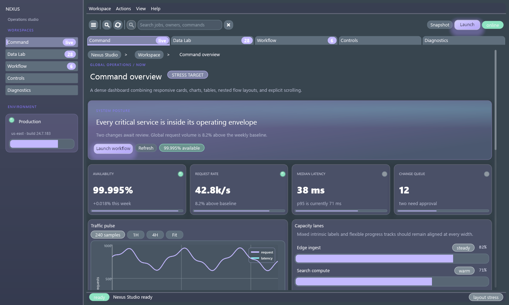
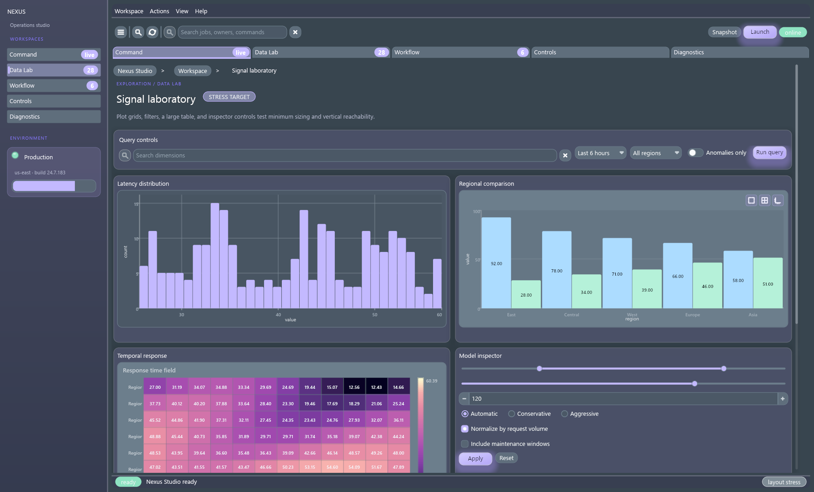
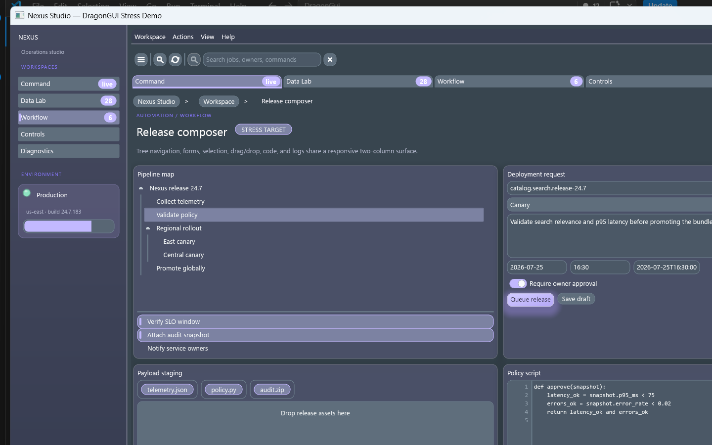
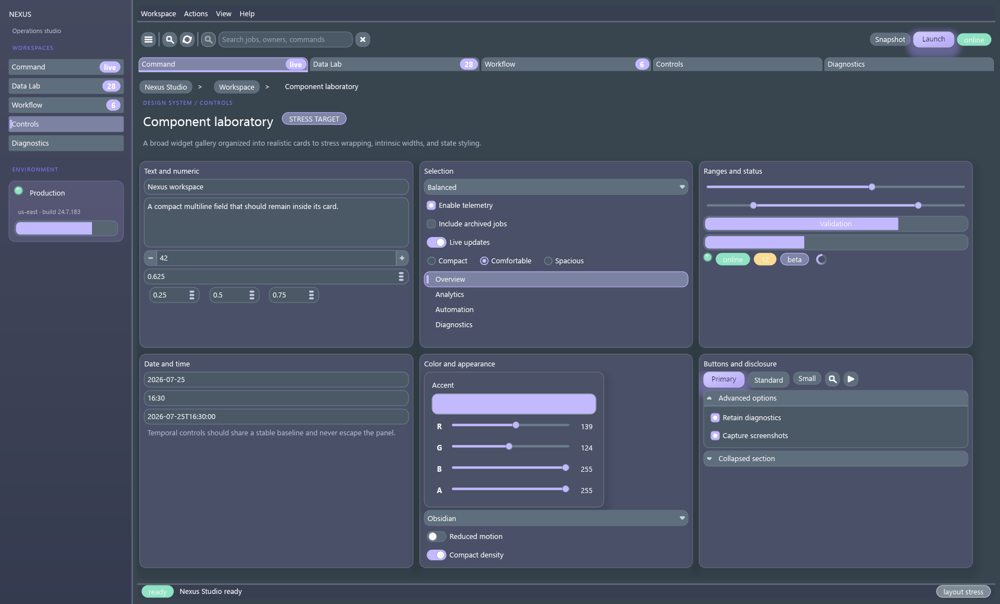
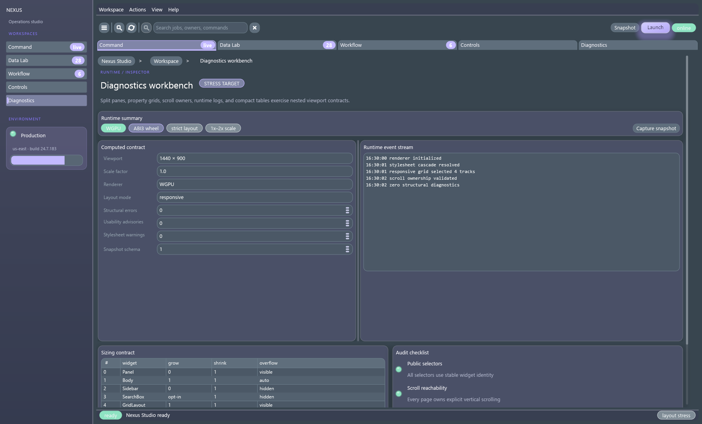
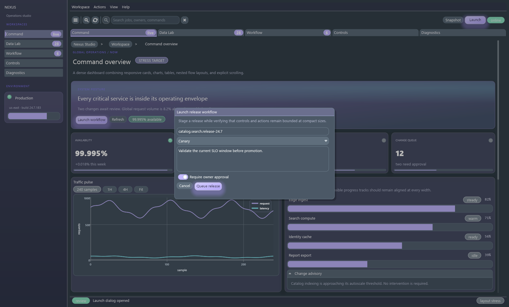
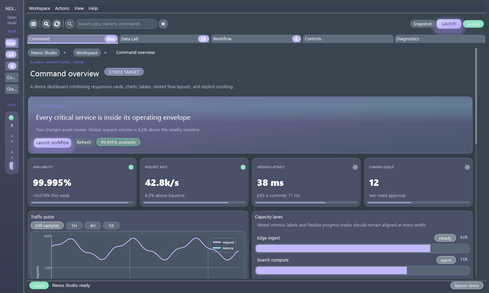
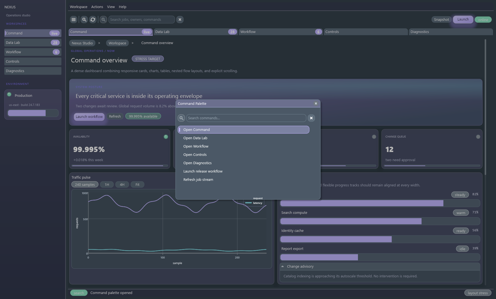
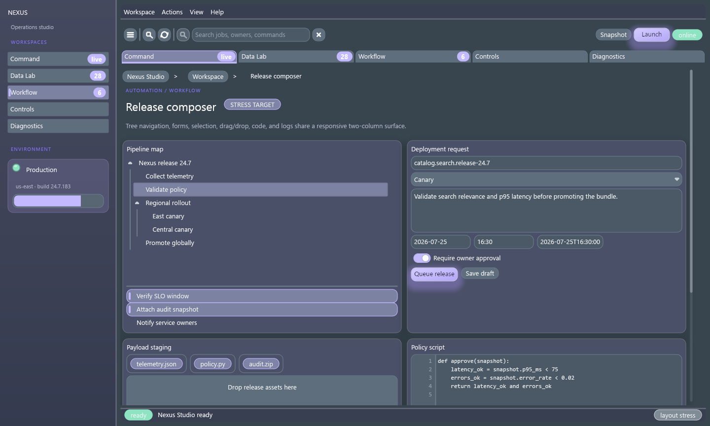

# DragonGUI Visual Audit Report

Generated: 2026-07-25 17:30:55 Eastern Daylight Time

This is a manifest-driven visual audit. `pass` means the saved screenshot state was visually reviewed against `artifacts/SPEC.md` and no obvious defect was recorded. `needs_manual_interaction` means the static capture was reviewed, but important hover/open/drag/focus or animated states still need manual or automated interaction coverage.

## Summary

- pass: 1
- needs_manual_interaction: 0
- fail: 0
- blocked: 0

## Targets

### Nexus Studio Stress Demo (`nexus-studio-stress`)

- Status: `pass`
- Priority: `low`
- Probe: `examples\nexus_studio_stress_demo.py`
- Features: `Flagship stress demo`, `AppShell`, `Sidebar`, `MenuBar`, `Toolbar`, `Tabs`, `Pages`, `Body`, `ScrollArea`, `responsive GridLayout`, `FlowLayout`, `Splitter`, `DataFrameTable`, `LinePlot`, `Histogram`, `BarChart`, `Heatmap`, `PieChart`, `TreeView`, `forms`, `CodeEditor`, `LogView`, `Modal`, `CommandPalette`
- Screenshots: [nexus-studio-stress-1440x900@1x-command.png](screenshots/nexus-studio-stress-1440x900@1x-command.png), [nexus-studio-stress-1440x900@1x-data.png](screenshots/nexus-studio-stress-1440x900@1x-data.png), [nexus-studio-stress-1440x900@1x-workflow.png](screenshots/nexus-studio-stress-1440x900@1x-workflow.png), [nexus-studio-stress-1440x900@1x-controls.png](screenshots/nexus-studio-stress-1440x900@1x-controls.png), [nexus-studio-stress-1440x900@1x-diagnostics.png](screenshots/nexus-studio-stress-1440x900@1x-diagnostics.png), [nexus-studio-stress-1440x900@1x-modal-open.png](screenshots/nexus-studio-stress-1440x900@1x-modal-open.png), [nexus-studio-stress-1440x900@1x-modal-roundtrip.png](screenshots/nexus-studio-stress-1440x900@1x-modal-roundtrip.png), [nexus-studio-stress-1440x900@1x-sidebar-collapsed.png](screenshots/nexus-studio-stress-1440x900@1x-sidebar-collapsed.png), [nexus-studio-stress-1440x900@1x-sidebar-roundtrip.png](screenshots/nexus-studio-stress-1440x900@1x-sidebar-roundtrip.png), [nexus-studio-stress-1440x900@1x-palette-open.png](screenshots/nexus-studio-stress-1440x900@1x-palette-open.png), [nexus-studio-stress-1440x900@1x-workflow-scrolled.png](screenshots/nexus-studio-stress-1440x900@1x-workflow-scrolled.png)
- Debug snapshots: [nexus-studio-stress-1440x900@1x-command.json](snapshots/nexus-studio-stress-1440x900@1x-command.json), [nexus-studio-stress-1440x900@1x-command-resize-0-start-1440x864.json](snapshots/nexus-studio-stress-1440x900@1x-command-resize-0-start-1440x864.json), [nexus-studio-stress-1440x900@1x-command-resize-1-640x480.json](snapshots/nexus-studio-stress-1440x900@1x-command-resize-1-640x480.json), [nexus-studio-stress-1440x900@1x-command-resize-2-1024x768.json](snapshots/nexus-studio-stress-1440x900@1x-command-resize-2-1024x768.json), [nexus-studio-stress-1440x900@1x-command-resize-3-1440x864.json](snapshots/nexus-studio-stress-1440x900@1x-command-resize-3-1440x864.json), [nexus-studio-stress-1440x900@1x-data.json](snapshots/nexus-studio-stress-1440x900@1x-data.json), [nexus-studio-stress-1440x900@1x-data-resize-0-start-1440x864.json](snapshots/nexus-studio-stress-1440x900@1x-data-resize-0-start-1440x864.json), [nexus-studio-stress-1440x900@1x-data-resize-1-640x480.json](snapshots/nexus-studio-stress-1440x900@1x-data-resize-1-640x480.json), [nexus-studio-stress-1440x900@1x-data-resize-2-1024x768.json](snapshots/nexus-studio-stress-1440x900@1x-data-resize-2-1024x768.json), [nexus-studio-stress-1440x900@1x-data-resize-3-1440x864.json](snapshots/nexus-studio-stress-1440x900@1x-data-resize-3-1440x864.json), [nexus-studio-stress-1440x900@1x-workflow.json](snapshots/nexus-studio-stress-1440x900@1x-workflow.json), [nexus-studio-stress-1440x900@1x-workflow-resize-0-start-1440x864.json](snapshots/nexus-studio-stress-1440x900@1x-workflow-resize-0-start-1440x864.json), [nexus-studio-stress-1440x900@1x-workflow-resize-1-640x480.json](snapshots/nexus-studio-stress-1440x900@1x-workflow-resize-1-640x480.json), [nexus-studio-stress-1440x900@1x-workflow-resize-2-1024x768.json](snapshots/nexus-studio-stress-1440x900@1x-workflow-resize-2-1024x768.json), [nexus-studio-stress-1440x900@1x-workflow-resize-3-1440x864.json](snapshots/nexus-studio-stress-1440x900@1x-workflow-resize-3-1440x864.json), [nexus-studio-stress-1440x900@1x-controls.json](snapshots/nexus-studio-stress-1440x900@1x-controls.json), [nexus-studio-stress-1440x900@1x-controls-resize-0-start-1440x864.json](snapshots/nexus-studio-stress-1440x900@1x-controls-resize-0-start-1440x864.json), [nexus-studio-stress-1440x900@1x-controls-resize-1-640x480.json](snapshots/nexus-studio-stress-1440x900@1x-controls-resize-1-640x480.json), [nexus-studio-stress-1440x900@1x-controls-resize-2-1024x768.json](snapshots/nexus-studio-stress-1440x900@1x-controls-resize-2-1024x768.json), [nexus-studio-stress-1440x900@1x-controls-resize-3-1440x864.json](snapshots/nexus-studio-stress-1440x900@1x-controls-resize-3-1440x864.json), [nexus-studio-stress-1440x900@1x-diagnostics.json](snapshots/nexus-studio-stress-1440x900@1x-diagnostics.json), [nexus-studio-stress-1440x900@1x-diagnostics-resize-0-start-1440x864.json](snapshots/nexus-studio-stress-1440x900@1x-diagnostics-resize-0-start-1440x864.json), [nexus-studio-stress-1440x900@1x-diagnostics-resize-1-640x480.json](snapshots/nexus-studio-stress-1440x900@1x-diagnostics-resize-1-640x480.json), [nexus-studio-stress-1440x900@1x-diagnostics-resize-2-1024x768.json](snapshots/nexus-studio-stress-1440x900@1x-diagnostics-resize-2-1024x768.json), [nexus-studio-stress-1440x900@1x-diagnostics-resize-3-1440x864.json](snapshots/nexus-studio-stress-1440x900@1x-diagnostics-resize-3-1440x864.json), [nexus-studio-stress-1440x900@1x-modal-open.json](snapshots/nexus-studio-stress-1440x900@1x-modal-open.json), [nexus-studio-stress-1440x900@1x-modal-open-resize-0-start-1440x864.json](snapshots/nexus-studio-stress-1440x900@1x-modal-open-resize-0-start-1440x864.json), [nexus-studio-stress-1440x900@1x-modal-open-resize-1-640x480.json](snapshots/nexus-studio-stress-1440x900@1x-modal-open-resize-1-640x480.json), [nexus-studio-stress-1440x900@1x-modal-open-resize-2-1024x768.json](snapshots/nexus-studio-stress-1440x900@1x-modal-open-resize-2-1024x768.json), [nexus-studio-stress-1440x900@1x-modal-open-resize-3-1440x864.json](snapshots/nexus-studio-stress-1440x900@1x-modal-open-resize-3-1440x864.json), [nexus-studio-stress-1440x900@1x-modal-roundtrip.json](snapshots/nexus-studio-stress-1440x900@1x-modal-roundtrip.json), [nexus-studio-stress-1440x900@1x-modal-roundtrip-resize-0-start-1440x864.json](snapshots/nexus-studio-stress-1440x900@1x-modal-roundtrip-resize-0-start-1440x864.json), [nexus-studio-stress-1440x900@1x-modal-roundtrip-resize-1-640x480.json](snapshots/nexus-studio-stress-1440x900@1x-modal-roundtrip-resize-1-640x480.json), [nexus-studio-stress-1440x900@1x-modal-roundtrip-resize-2-1024x768.json](snapshots/nexus-studio-stress-1440x900@1x-modal-roundtrip-resize-2-1024x768.json), [nexus-studio-stress-1440x900@1x-modal-roundtrip-resize-3-1440x864.json](snapshots/nexus-studio-stress-1440x900@1x-modal-roundtrip-resize-3-1440x864.json), [nexus-studio-stress-1440x900@1x-sidebar-collapsed.json](snapshots/nexus-studio-stress-1440x900@1x-sidebar-collapsed.json), [nexus-studio-stress-1440x900@1x-sidebar-collapsed-resize-0-start-1440x864.json](snapshots/nexus-studio-stress-1440x900@1x-sidebar-collapsed-resize-0-start-1440x864.json), [nexus-studio-stress-1440x900@1x-sidebar-collapsed-resize-1-640x480.json](snapshots/nexus-studio-stress-1440x900@1x-sidebar-collapsed-resize-1-640x480.json), [nexus-studio-stress-1440x900@1x-sidebar-collapsed-resize-2-1024x768.json](snapshots/nexus-studio-stress-1440x900@1x-sidebar-collapsed-resize-2-1024x768.json), [nexus-studio-stress-1440x900@1x-sidebar-collapsed-resize-3-1440x864.json](snapshots/nexus-studio-stress-1440x900@1x-sidebar-collapsed-resize-3-1440x864.json), [nexus-studio-stress-1440x900@1x-sidebar-roundtrip.json](snapshots/nexus-studio-stress-1440x900@1x-sidebar-roundtrip.json), [nexus-studio-stress-1440x900@1x-sidebar-roundtrip-resize-0-start-1440x864.json](snapshots/nexus-studio-stress-1440x900@1x-sidebar-roundtrip-resize-0-start-1440x864.json), [nexus-studio-stress-1440x900@1x-sidebar-roundtrip-resize-1-640x480.json](snapshots/nexus-studio-stress-1440x900@1x-sidebar-roundtrip-resize-1-640x480.json), [nexus-studio-stress-1440x900@1x-sidebar-roundtrip-resize-2-1024x768.json](snapshots/nexus-studio-stress-1440x900@1x-sidebar-roundtrip-resize-2-1024x768.json), [nexus-studio-stress-1440x900@1x-sidebar-roundtrip-resize-3-1440x864.json](snapshots/nexus-studio-stress-1440x900@1x-sidebar-roundtrip-resize-3-1440x864.json), [nexus-studio-stress-1440x900@1x-palette-open.json](snapshots/nexus-studio-stress-1440x900@1x-palette-open.json), [nexus-studio-stress-1440x900@1x-palette-open-resize-0-start-1440x864.json](snapshots/nexus-studio-stress-1440x900@1x-palette-open-resize-0-start-1440x864.json), [nexus-studio-stress-1440x900@1x-palette-open-resize-1-640x480.json](snapshots/nexus-studio-stress-1440x900@1x-palette-open-resize-1-640x480.json), [nexus-studio-stress-1440x900@1x-palette-open-resize-2-1024x768.json](snapshots/nexus-studio-stress-1440x900@1x-palette-open-resize-2-1024x768.json), [nexus-studio-stress-1440x900@1x-palette-open-resize-3-1440x864.json](snapshots/nexus-studio-stress-1440x900@1x-palette-open-resize-3-1440x864.json), [nexus-studio-stress-1440x900@1x-workflow-scrolled.json](snapshots/nexus-studio-stress-1440x900@1x-workflow-scrolled.json), [nexus-studio-stress-1440x900@1x-workflow-scrolled-resize-0-start-1440x864.json](snapshots/nexus-studio-stress-1440x900@1x-workflow-scrolled-resize-0-start-1440x864.json), [nexus-studio-stress-1440x900@1x-workflow-scrolled-resize-1-640x480.json](snapshots/nexus-studio-stress-1440x900@1x-workflow-scrolled-resize-1-640x480.json), [nexus-studio-stress-1440x900@1x-workflow-scrolled-resize-2-1024x768.json](snapshots/nexus-studio-stress-1440x900@1x-workflow-scrolled-resize-2-1024x768.json), [nexus-studio-stress-1440x900@1x-workflow-scrolled-resize-3-1440x864.json](snapshots/nexus-studio-stress-1440x900@1x-workflow-scrolled-resize-3-1440x864.json)
- Logs: [nexus-studio-stress-1440x900@1x-command.stdout.txt](logs/nexus-studio-stress-1440x900@1x-command.stdout.txt), [nexus-studio-stress-1440x900@1x-command.stderr.txt](logs/nexus-studio-stress-1440x900@1x-command.stderr.txt), [nexus-studio-stress-1440x900@1x-data.stdout.txt](logs/nexus-studio-stress-1440x900@1x-data.stdout.txt), [nexus-studio-stress-1440x900@1x-data.stderr.txt](logs/nexus-studio-stress-1440x900@1x-data.stderr.txt), [nexus-studio-stress-1440x900@1x-workflow.stdout.txt](logs/nexus-studio-stress-1440x900@1x-workflow.stdout.txt), [nexus-studio-stress-1440x900@1x-workflow.stderr.txt](logs/nexus-studio-stress-1440x900@1x-workflow.stderr.txt), [nexus-studio-stress-1440x900@1x-controls.stdout.txt](logs/nexus-studio-stress-1440x900@1x-controls.stdout.txt), [nexus-studio-stress-1440x900@1x-controls.stderr.txt](logs/nexus-studio-stress-1440x900@1x-controls.stderr.txt), [nexus-studio-stress-1440x900@1x-diagnostics.stdout.txt](logs/nexus-studio-stress-1440x900@1x-diagnostics.stdout.txt), [nexus-studio-stress-1440x900@1x-diagnostics.stderr.txt](logs/nexus-studio-stress-1440x900@1x-diagnostics.stderr.txt), [nexus-studio-stress-1440x900@1x-modal-open.stdout.txt](logs/nexus-studio-stress-1440x900@1x-modal-open.stdout.txt), [nexus-studio-stress-1440x900@1x-modal-open.stderr.txt](logs/nexus-studio-stress-1440x900@1x-modal-open.stderr.txt), [nexus-studio-stress-1440x900@1x-modal-roundtrip.stdout.txt](logs/nexus-studio-stress-1440x900@1x-modal-roundtrip.stdout.txt), [nexus-studio-stress-1440x900@1x-modal-roundtrip.stderr.txt](logs/nexus-studio-stress-1440x900@1x-modal-roundtrip.stderr.txt), [nexus-studio-stress-1440x900@1x-sidebar-collapsed.stdout.txt](logs/nexus-studio-stress-1440x900@1x-sidebar-collapsed.stdout.txt), [nexus-studio-stress-1440x900@1x-sidebar-collapsed.stderr.txt](logs/nexus-studio-stress-1440x900@1x-sidebar-collapsed.stderr.txt), [nexus-studio-stress-1440x900@1x-sidebar-roundtrip.stdout.txt](logs/nexus-studio-stress-1440x900@1x-sidebar-roundtrip.stdout.txt), [nexus-studio-stress-1440x900@1x-sidebar-roundtrip.stderr.txt](logs/nexus-studio-stress-1440x900@1x-sidebar-roundtrip.stderr.txt), [nexus-studio-stress-1440x900@1x-palette-open.stdout.txt](logs/nexus-studio-stress-1440x900@1x-palette-open.stdout.txt), [nexus-studio-stress-1440x900@1x-palette-open.stderr.txt](logs/nexus-studio-stress-1440x900@1x-palette-open.stderr.txt), [nexus-studio-stress-1440x900@1x-workflow-scrolled.stdout.txt](logs/nexus-studio-stress-1440x900@1x-workflow-scrolled.stdout.txt), [nexus-studio-stress-1440x900@1x-workflow-scrolled.stderr.txt](logs/nexus-studio-stress-1440x900@1x-workflow-scrolled.stderr.txt)
- Unmatched selectors: _none_
- Layout diagnostics by code: _none_
- Notes: Five-workspace flagship demo intended to stress dense responsive layout, broad widget coverage, scrolling, overlay bounds, selector coverage, and state transitions. Additional run: No visual issue recorded by automated first pass.
- Suspected modules: `native/src/layout.rs`, `native/src/primitives/mod.rs`, `native/src/runtime.rs`, `native/src/scatter/mod.rs`, `native/src/table.rs`, `native/src/text/mod.rs`
- Reproduction: `python tools/visual_audit.py --target nexus-studio-stress --sizes 1440x900 --scales 1 # state=command`; `python tools/visual_audit.py --target nexus-studio-stress --sizes 1440x900 --scales 1 # state=data`; `python tools/visual_audit.py --target nexus-studio-stress --sizes 1440x900 --scales 1 # state=workflow`; `python tools/visual_audit.py --target nexus-studio-stress --sizes 1440x900 --scales 1 # state=controls`; `python tools/visual_audit.py --target nexus-studio-stress --sizes 1440x900 --scales 1 # state=diagnostics`; `python tools/visual_audit.py --target nexus-studio-stress --sizes 1440x900 --scales 1 # state=modal-open`; `python tools/visual_audit.py --target nexus-studio-stress --sizes 1440x900 --scales 1 # state=modal-roundtrip`; `python tools/visual_audit.py --target nexus-studio-stress --sizes 1440x900 --scales 1 # state=sidebar-collapsed`; `python tools/visual_audit.py --target nexus-studio-stress --sizes 1440x900 --scales 1 # state=sidebar-roundtrip`; `python tools/visual_audit.py --target nexus-studio-stress --sizes 1440x900 --scales 1 # state=palette-open`; `python tools/visual_audit.py --target nexus-studio-stress --sizes 1440x900 --scales 1 # state=workflow-scrolled`

#### Capture Gallery

| Size | Scale | Route | State | Thumbnail |
| --- | ---: | --- | --- | --- |
| `1440x900` | `1x` | `command` | `command` |  |
| `1440x900` | `1x` | `data` | `data` |  |
| `1440x900` | `1x` | `workflow` | `workflow` |  |
| `1440x900` | `1x` | `controls` | `controls` |  |
| `1440x900` | `1x` | `diagnostics` | `diagnostics` |  |
| `1440x900` | `1x` | `command` | `modal-open` |  |
| `1440x900` | `1x` | `command` | `modal-roundtrip` |  |
| `1440x900` | `1x` | `command` | `sidebar-collapsed` |  |
| `1440x900` | `1x` | `command` | `sidebar-roundtrip` |  |
| `1440x900` | `1x` | `command` | `palette-open` |  |
| `1440x900` | `1x` | `workflow` | `workflow-scrolled` |  |

#### Diagnostic State Comparisons

- `1440x900 @ 1x`: `command` → `data` — _no diagnostic changes_
- `1440x900 @ 1x`: `command` → `workflow` — _no diagnostic changes_
- `1440x900 @ 1x`: `command` → `controls` — _no diagnostic changes_
- `1440x900 @ 1x`: `command` → `diagnostics` — _no diagnostic changes_
- `1440x900 @ 1x`: `command` → `modal-open` — _no diagnostic changes_
- `1440x900 @ 1x`: `command` → `modal-roundtrip` — _no diagnostic changes_
- `1440x900 @ 1x`: `command` → `sidebar-collapsed` — _no diagnostic changes_
- `1440x900 @ 1x`: `command` → `sidebar-roundtrip` — _no diagnostic changes_
- `1440x900 @ 1x`: `command` → `palette-open` — _no diagnostic changes_
- `1440x900 @ 1x`: `command` → `workflow-scrolled` — _no diagnostic changes_
