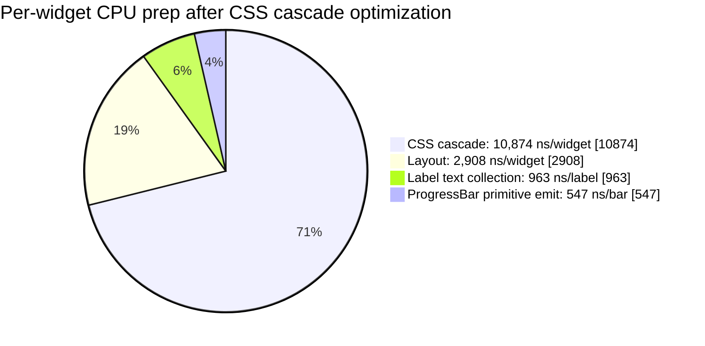
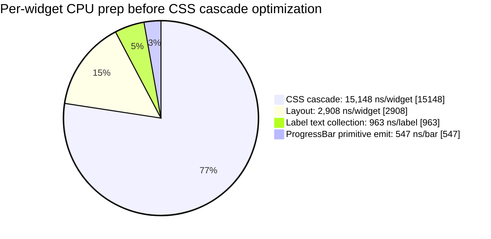
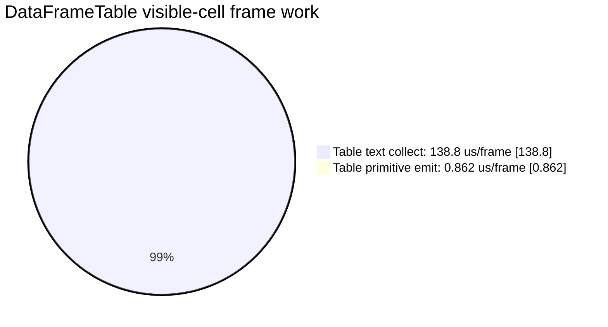
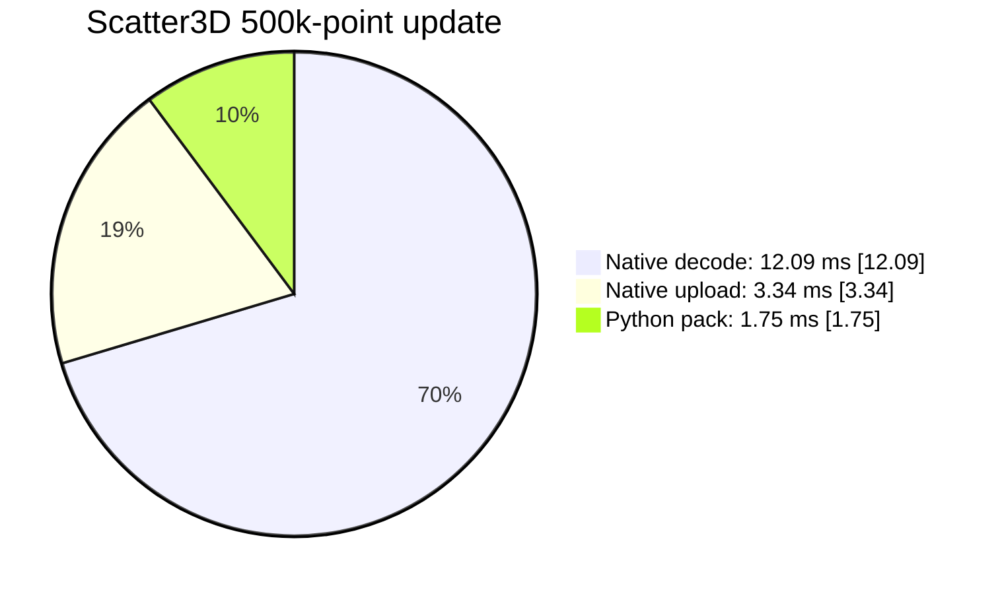
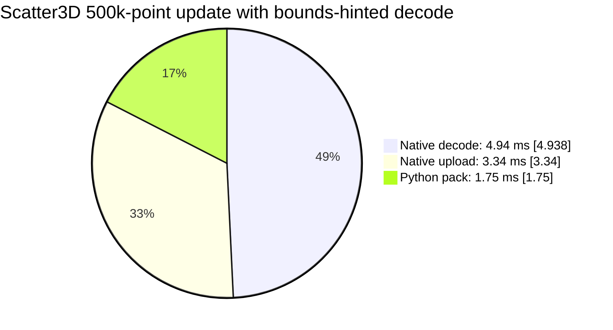
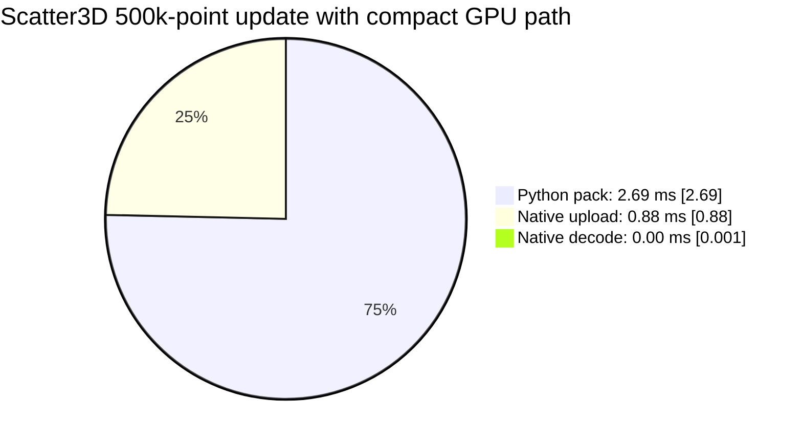

# DragonGUI Benchmark Pie Charts

Date: 2026-05-22

These charts group only comparable timings together. They should not be read as
a single global frame-time breakdown because the benchmark units differ by area.

## Per-Widget CPU Prep

This compares normalized per-item native microbenchmarks. The CSS slice uses the
optimized cascade result.

Before the CSS cascade optimization:

CSS cascade changed from `15,148 ns/widget` to `10,874 ns/widget`, reducing the
CSS slice from about `77%` of this comparison group to about `71%`.

## DataFrameTable Frame Work

This compares the table-specific visible-cell work from the native
microbenchmarks.

The table is overwhelmingly text-bound in this benchmark. Cell chrome is already
cheap relative to visible-cell text collection.

## Scatter3D Frame Replacement

This compares the measured pieces of a 500k-point packed `xyz_f32_v0` update.

Scatter3D frame replacement is decode-bound in this benchmark. Upload is the
second-largest measured piece.

After the bounds-hinted decode fast path, the isolated 500k-point decode
microbenchmark measured `4.938 ms` for decode. Keeping the original upload and
Python pack timings for scale:

After the compact GPU path, the same windowed 500k-point benchmark measured
native decode as zero and reduced upload/native update substantially:

## Takeaways

- CSS cascade is still a major per-widget CPU cost, even after the first
  optimization pass.
- DataFrameTable optimization should focus on text collection and text buffer
  reuse before primitive emission.
- Scatter3D default xyz streaming is no longer native-decode-bound when bounds
  are provided. The next likely win is reducing Python packing/copy cost.
